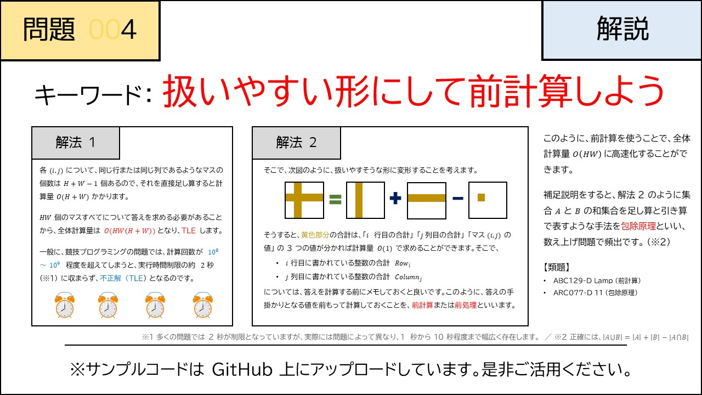

# 004 - Cross Sum（★2）

- [004 - Cross Sum（★2）](#004---cross-sum2)
  - [制約](#制約)
  - [回答](#回答)
  - [解説](#解説)
  - [類題](#類題)

[問題](https://atcoder.jp/contests/typical90/tasks/typical90_d)  
$H$行$W$列のマス目があり、$i$行目$j$列目には$A_{i,j}$が書かれている  
すべてのマスについて、同じ行、同じ列に書かれた数字の和を求めよ。

## 制約
$2 \le H, W \le 2000$  
$1 \le A_{i,j} \le 99$  
入力はすべて整数

## 回答
事前に各行、各列の和を求めておく。  
$ans_{i,j} = i行の総和+j列の総和-A_{i,j}$

これは$O(1)$で求められるので全体で$O(HW)$

## 解説



## 類題
[ABC129 - D Lamp](https://atcoder.jp/contests/abc129/tasks/abc129_d)  
[提出コード](004-1.py)
前計算で各マスの横の範囲、縦の範囲を求めておく  

[ARC077 - D 11](https://atcoder.jp/contests/arc077/tasks/arc077_b)
[提出コード](004-2.py)

**階乗の前計算、階乗の逆元** [**ライブラリ**](../../library/combination.md)   
２回登場する数字が１つだけある、$１〜N$までの数列(長さ$N+1$)$A$
の部分列の種類の数を答える  

**包除原理**  
n+1個からi個選ぶ - 2つある数字を選んで重複した部分列  
どんなときに重複するかコードをかいて実験
```　python
import itertools
from collections import Counter
n = 10
A = [1, 2, 3, 4, 5, 6, 7, 4, 8, 9, 10]

for i in range(1, n+2):
    C = Counter(itertools.combinations(A, i))
    print([c for c, v in C.items() if v > 1])
```

２回登場する数字のindexを
前半を$ante$後半を$post$として  

$i=2$のとき  

$_{ante} C _1 * _{post} C _0$: anteより前とanteを選ぶ  
$_{ante} C _0 * _{post} C _1$: postとpostより後を選ぶ  

$i=3$のとき  

$_{ante} C _0 * _{post} C _2$: ante or post, postより後を2つ  
$_{ante} C _1 * _{post} C _1$: anteより前、ante or post, postより後  
$_{ante} C _2 * _{post} C _0$: anteより前を2つ, ante or post  

$i=4$のとき  

$_{ante} C _0 * _{post} C _3$: postより後を3つ  
$_{ante} C _1 * _{post} C _2$: anteより前、ante or post, postより後を2つ  
$_{ante} C _2 * _{post} C _1$: anteより前を2つ, ante or post, postより後  
$_{ante} C _3 * _{post} C _0$: anteより前を3つ, ante or post

$\sum_{a=1}^{i-1}  {}_{ante} C _a * _{post} C _{i-a}$
(ante<a or post<i-aなら0)

***この方針はTLEします。***
よく考えると
~ante とpost~からi-1個選んでいるだけなので、
つまりは$_{ante+post} C _{i-1}$を計算するだけでよいのです。
