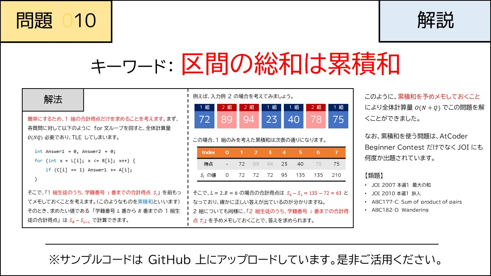

# 010 - Score Sum Queries（★2）

- [010 - Score Sum Queries（★2）](#010---score-sum-queries2)
  - [制約](#制約)
  - [回答](#回答)
  - [解説](#解説)
  - [類題](#類題)

[問題](https://atcoder.jp/contests/typical90/tasks/typical90_j)

ABC大学には$N$人の一年生が在籍しています。クラスは$2$つあり、学籍番号 
$i$番の生徒のクラスは$C_i$​組です。今日は期末試験が返却され、学籍番号 
$i$番の生徒の点数は$P_i$​点でした。  
以下の形式の質問が$Q$個与えられます。
$j = 1, 2, …, Q$ それぞれについて答えてください。

 - 学籍番号 $L_j ∼ R_j$ 番の$1$組生徒における、期末試験点数の合計
 - 学籍番号 $L_j ~ R_j$ 番の$2$組生徒における、期末試験点数の合計
 - これら$2$つの値をそれぞれ求めよ。

## 制約
 - $1 \le N \le 100000$
 - $1 \le C \le 2$
 - $0 \le P_i \le 100$
 - $0 \le Q \le 100000$
 - $1 \le L_j \le R_j \le N$
 - 入力はすべて整数

## 回答
学籍番号分の配列を2組分作る。各クエリに答えるために累積和をとる。もしくはセグ木で殴る。

**セグ木**[ライブラリ](../../library/segmenttree.py)

## 解説

## 類題
[A - 最大の和](https://atcoder.jp/contests/joi2007ho/tasks/joi2007ho_a)  
[提出コード](010-1.py)
累積和をとって長さ３の区間和の合計を求める  
[A - 旅人](https://atcoder.jp/contests/joi2010ho/tasks/joi2010ho_a)  
[提出コード](010-2.py)やるだけ…  
[C - Sum of product of pairs](https://atcoder.jp/contests/abc177/tasks/abc177_c)
[提出コード](010-3.py)
$\sum _{i=0}^n A_i \times(\sum _{j=0}^{i-1}A_j)$
二個目のシグマは累積和で求める  
[D - Wandering](https://atcoder.jp/contests/abc182/tasks/abc182_d)
[提出コード](010-4.py)
累積和の問題はセグ木で殴れることが多い

