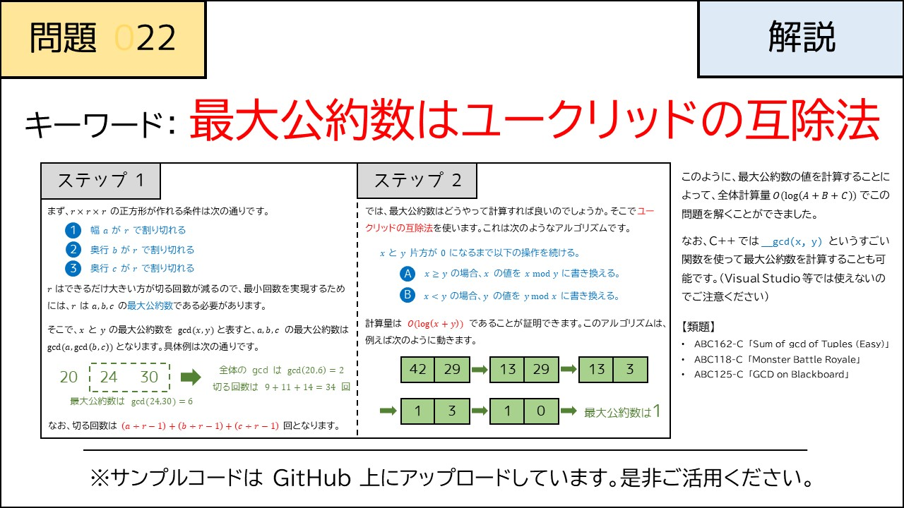

# 022 - Cubic Cake（★2）

- [022 - Cubic Cake（★2）](#022---cubic-cake2)
  - [制約](#制約)
  - [回答](#回答)
  - [解説](#解説)
  - [類題](#類題)

[問題](https://atcoder.jp/contests/typical90/tasks/typical90_v)  
$A \times B \times C$の直方体を立方体に分割するには何カット必要？

## 制約
$1 \le A, B, C \le 10^{18}$  
入力はすべて整数

## 回答
gcd(A, B, C)
 
## 解説

## 類題
