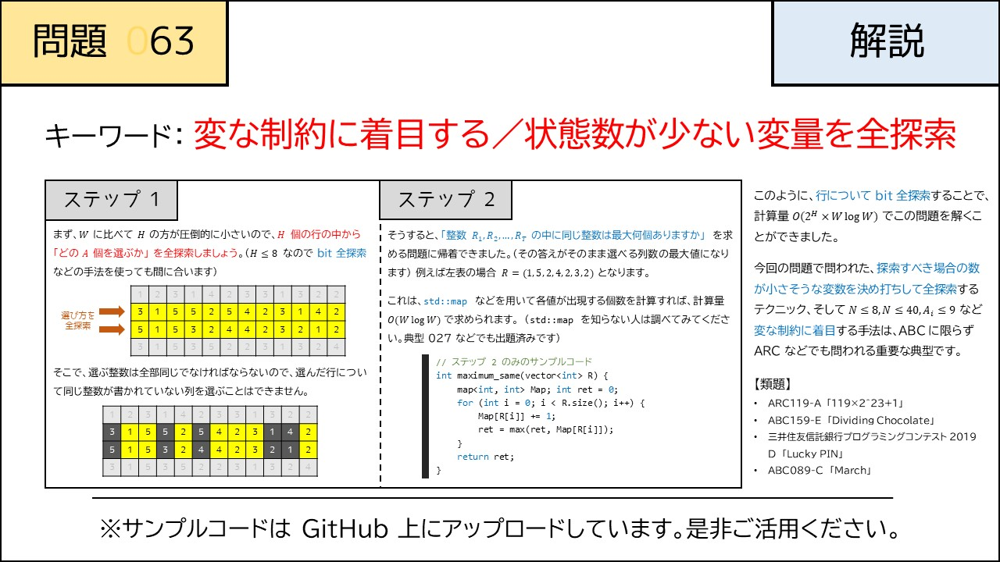

# 063 - Monochromatic Subgrid（★4）

- [063 - Monochromatic Subgrid（★4）](#063---monochromatic-subgrid4)
  - [制約](#制約)
  - [回答](#回答)
  - [解説](#解説)
  - [類題](#類題)

[問題](https://atcoder.jp/contests/typical90/tasks/typical90_bk)  
すべてのセルが同じ数字になるように複数の行、列を選択したとき、セルの数の最大は？

## 制約
$1 \le H \le 8$  
$1 \le W \le 10000$  
$1 \le P_{i,j} \le HW$ 

入力はすべて整数

## 回答
$H$が$8$までしかないことに注目  
行の選び方は全探索しても256通りしかないので  
列ごとに行の選び方を全探索し、すべて同じ数字になる場合を記録  
$C_{bit, num}$　行の選び方$bit$の時のセルに書かれた$num$の数
 
## 解説

## 類題
