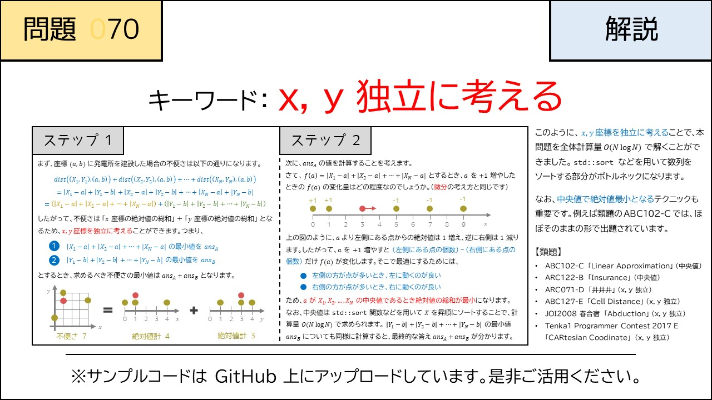

# 070 - Plant Planning（★4）

- [070 - Plant Planning（★4）](#070---plant-planning4)
  - [制約](#制約)
  - [回答](#回答)
  - [解説](#解説)
  - [類題](#類題)

[問題](https://atcoder.jp/contests/typical90/tasks/typical90_br)  
$N$個の座標$X_i, Y_i(i=0,1,...,n-1)$からある座標$X, Y$へのマンハッタン距離の総和を**不便さ**と定義したとき不便さとしてありえる最小の値を求めよ。

## 制約
$1 \le N \le 10^5$  
$-10^9 \le X_i, Y_i \le 10^9$  
入力はすべて整数

## 回答

$\sum_{i=0}^n|x_i-a| + |y_i-b|$  
ここで、xとyは独立に考えることができる

$\sum_{i=0}^n |x_i - a|$を最小化することを考えれば良い
これは$x_i$の中央値で最小になるらしい。$X,Y$それぞれをソートして中央値を求め($O(NlogN)$)不便さを求めると良い。

以下なぜ中央値なのかの証明の話。

”絶対値 中央値”でgoogle検索すると  
https://hiraocafe.com/note/baratsuki.html  
素晴らしいサイトが見つかる。以下写経

$x_i(i=1, 2, ..., n)$を昇順にソートした配列を$X_i(i=1, 2, ..., n)$とする

ここで$x_k \le b \le x_{k+1}$とおくと

$\sum_{i=0}^n|x_i-a|$  
$= \sum_{i=0}^k(b-X_i) + \sum_{i=k+1}^n(X_i-b)$  
$= kb - \sum_{i=0}^kX_i + \sum_{i=k+1}^nX_i-(n-k)b$  
$= (2k-n)b - \sum_{i=0}^kX_i + \sum_{i=k+1}^nX_i　\cdots(1)$

$(1)$は$b$について傾き$2k-n$の一次関数$f(b)$とみなすことができる。  

$(i) n=2m+1(mは整数)$のとき  
$0\le k \le m$つまり$b\le X_{m+1}$では$2k - n < 0$より$f(b)$は単調減少  
$m+1 \le k \le n$つまり$X_{m+1}\le b$では$2k - n > 0$より$f(b)$は単調増加  
以上より$b = X_{m+1}$つまり**中央値**のとき$f(b)$は最小。

$(ii) n=2m(mは整数)$のとき  
$0\le k \le m-1$つまり$b \le X_{m}$では$2k - n < 0$より$f(b)$は単調減少  
$k=m$つまり$X_m \le b \le X_{m+1}$では$f(b) = - \sum_{i=0}^kX_i + \sum_{i=k+1}^nX_i$となり$f(x)$は一定の値をとる  
$m+1\le k \le n$つまり$X_m \le b$では$2k-n>0$より$f(b)$は単調増加  
以上より$X_m \le b \le X_{m+1}$のとき(この範囲に**中央値**を含む)$f(b)$は最小

## 解説

## 類題

